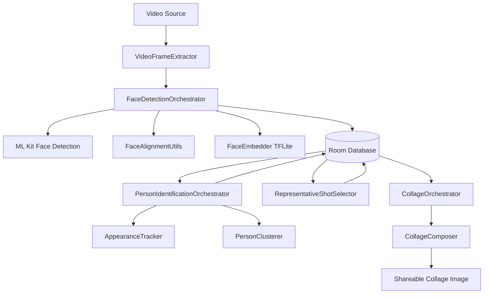

# iykyk Android Internship Assignment — Video-Based Unique-Person Collage

An Android app that processes a portrait video entirely on-device: detects
every face, groups appearances of the same person, picks each person's best
representative shot, and composes a shareable collage.

## Stack

- Kotlin, Jetpack Compose, minSdk 26
- ML Kit Face Detection (bounding boxes, landmarks, head pose, eyes-open /
  smiling probabilities)
- A custom on-device TFLite embedding model (see **Embedding model** below)
- Room (local persistence across the pipeline's phases)
- Hilt (dependency injection)
- Everything runs on-device — no backend, no network calls at inference time

## Architecture

The app follows a Clean Architecture approach with a clear separation between UI, Domain, and Data layers. Processing is implemented as a sequential, multi-phase pipeline to manage memory and computational complexity.

### High-Level Data Flow

### Sequential Pipeline Phases

Processing is split into four sequential phases, each independently progress-reporting, allowing for efficient resource management:

1.  **Face Detection & Embedding (`FaceDetectionOrchestrator`)**:
    *   Extracts sampled frames using `MediaMetadataRetriever`.
    *   Runs ML Kit for face detection and landmark extraction.
    *   **Alignment**: Uses `FaceAlignmentUtils` to normalize faces based on eye landmarks.
    *   **Embedding**: Generates 192-d vectors via `FaceEmbedder`.
    *   **Persistence**: Stores detections (bounding boxes, embeddings, quality scores, frame paths) into Room.
2.  **Person Identification (`PersonIdentificationOrchestrator`)**:
    *   **Short-term Tracking**: `AppearanceTracker` links detections across consecutive frames into "Appearances" based on embedding similarity and spatial continuity.
    *   **Long-term Clustering**: `PersonClusterer` groups appearances into unique identities ("Persons") by comparing them against running cluster centroids.
3.  **Best Shot Selection (`RepresentativeShotSelector`)**:
    *   Analyzes all detections associated with a specific person.
    *   Ranks them based on ML Kit quality signals (eyes open, smiling, head pose) and selects the best representative image.
4.  **Collage Generation (`CollageOrchestrator`)**:
    *   Aggregates the representative shots and appearance statistics.
    *   `CollageComposer` performs the final bitmap composition and saves the result to local storage.

### Data Layer & Persistence

The app uses **Room** as a central source of truth and a buffer between processing phases. This "two-pass" design (detect then identify) is memory-efficient: phase 1 handles large video frame bitmaps and discards them immediately, while subsequent phases operate on the lightweight data stored in SQLite.

*   **Entities**: `FaceDetectionEntity`, `AppearanceEntity`, `PersonEntity`.
*   **DAOs**: Manage the persistence and retrieval of detection metadata.

### UI Layer & State Management

Built with **Jetpack Compose** following **Unidirectional Data Flow (UDF)**:
*   **`MainViewModel`**: Orchestrates the pipeline execution and manages `UiState`. It handles process lifecycle (start, cancel, reset) and navigation logic.
*   **Compose UI**: Observes `UiState` to render `Idle`, `Processing`, `Results`, or `Error` screens.
*   **Hilt**: Handles dependency injection for orchestrators, repositories, and the database.

## Embedding model

Faces are embedded with an on-device MobileFaceNet-family TFLite model —
[`mobilefacenet.tflite`](https://github.com/MCarlomagno/FaceRecognitionAuth/tree/master/assets),
sourced from the linked repo's assets — producing a 192-dimension,
L2-normalized embedding from a 112×112 aligned input.

**Alignment is mandatory, not optional, for this model family.** An earlier
version fed generously-cropped-but-unaligned face regions directly into the
embedder; same-person, same-instant crops at different framing/scale
produced pairwise cosine similarities as low as 0.31–0.48 — statistically
indistinguishable from two different people. `FaceAlignmentUtils` fixes
this: eye landmarks (from ML Kit) are used to build an affine transform
mapping each face to canonical eye positions (35%/65% width, 40% height)
before the 112×112 resize, matching how this model family is trained.
Alignment is bounded by first cropping generously around the face's own
detected bounding box — without this, a face that's large/close in the
source frame produces a small alignment scale factor, which (since a fixed
112×112 output has to sample a wider region of the source to shrink a
large face down) can otherwise pull a neighboring person's face into the
same aligned crop when two people are framed close together.

After alignment, same-instant same-person similarity moved into the
0.85–0.97 range, and the pipeline's clustering thresholds below were
re-tuned against that corrected signal.

## Handling duplicate detections within one frame

On low-quality or transitional frames, ML Kit can occasionally return
multiple candidate bounding boxes, at different scales, for what is
actually one face. IoU-based (bounding-box overlap) deduplication was
tried first and didn't catch this — a small box fully inside a much larger
one over the same face can have IoU well under a reasonable threshold
purely due to the scale difference, not because it's a different face.
`FaceDeduplicator` instead deduplicates by **embedding similarity**
(threshold 0.9) among candidates detected in the same frame — a much more
direct test of "is this the same identity," which scale-varying box
geometry can't answer reliably.

## Thresholds

- **`continuityThreshold` continuityThreshold (Frame-to-Frame Appearance Tracking): 0.5
  I initially opted for a strict threshold (~0.7) under the assumption that consecutive frames taken 200–300ms apart should not drift significantly in embedding space. 
  However, testing exposed an over-segmentation issue, creating false multiple appearances—especially in frames containing multiple faces. 
  Log analysis revealed that valid continuous tracking consistently maintained similarity scores above 0.5 (with clear single-face frames ranging between 0.8 and 0.9, 
  and multi-face frames hovering near 0.5). Lowering the threshold to 0.5 resolved the false fragmentation across the dataset. 
  While this threshold adjustment somewhat resolves the symptom within the assignment's time box, given additional time  
  I would investigate and resolve the underlying cause of embedding degradation in multi-face frames.
- **`identityThreshold` (cross-appearance identity clustering): 0.6 .** Chosen from logged real score distributions, not
  guessed: across a full test run, genuine same-person cross-appearance
  matches consistently scored 0.78–0.96, genuine different-person
  comparisons consistently scored 0.17–0.58, with occasional ambiguous
  cases in the low-0.6 range. The threshold sits with real margin on both
  sides of that gap.
- **`maxGapMs`: 1000ms.** How long a person can go undetected (motion blur,
  brief occlusion, a fast head turn) before their appearance is considered
  ended rather than continuous.

## Concurrency

`FaceDetectionOrchestrator` processes frames with bounded parallelism via
`Dispatchers.Default.limitedParallelism(7)`, allowing up to 7 frames'
detection/embedding work to run concurrently instead of strictly
sequentially. Because hardware video decoding is frequently serial
regardless of caller threading, a `Mutex` guards all access to the shared
`MediaMetadataRetriever` (via `VideoFrameExtractor`) so only one thread
reads from it at a time, while everything downstream of frame extraction
(detection, alignment, embedding, scoring) still runs in parallel. Since
frames can finish out of order under this scheme, progress is tracked with
an `AtomicInteger` counting completed frames across threads, rather than a
simple loop counter that would assume in-order completion.

## Memory safety

Every heavy resource is wrapped in `try`/`finally` so cleanup happens even
on cancellation or an error mid-pipeline:

- The `MediaMetadataRetriever` is created once in the orchestrator, passed
  down to the extractor, and explicitly `release()`d in a `finally` block
  rather than left to finalization.
- Every intermediate `Bitmap` — raw extracted frames, aligned crops, the
  final composed collage — is explicitly `recycle()`d as soon as it's no
  longer needed, in `FaceDetectionOrchestrator`, `CollageOrchestrator`, and
  `CollageComposer`. This means graphics memory is purged immediately even
  if a job is cancelled mid-loop, rather than waiting on garbage collection
  to eventually catch up.

## Navigation & cancellation

Back-navigation and cancellation are handled contextually rather than with
default system behavior throughout, since "processing" is a long-running
state where an accidental exit would be costly:

- **`MainViewModel.onBackPressed()`**  Consumes onBack event depending on the state:
  `Idle` The vm doesn't handle the back callback, it falls through to default system behavior (app exits normally) ;
  `Processing` consumes the back-press but ignores it, preventing an
  accidental interruption of an in-flight job; `Results` and `Error` both
  consume it by calling `reset()`, returning the user to `Idle` rather than
  exiting the app entirely. Wired into `MainScreen` via Compose's
  `BackHandler`.
- **Explicit cancellation** is also available from within `Processing`
  itself, not just blocked by the back-press guard above: the pipeline
  runs inside a managed `Job`, and `ProcessingContent` has a Cancel button
  wired to `MainViewModel.reset()`. Cancelling calls `job.cancel()`, which
  propagates a `CancellationException` through the coroutine tree and
  stops extraction/detection immediately rather than letting it run to
  completion in the background, then returns the UI to `Idle`.

## Known limitations

* **Multi-person proximity and rapid, clipped motion:** The system's heavy limitations lie with frames where multiple people are present simultaneously, and instances where a person is not fully in the frame and moves frequently. I attempted multiple mitigations to fix these edge cases to no avail, ultimately returning to a simpler baseline to prevent false negatives.
    * **Tested & Rejected — Restricting track initialization:** I tried a rule where a clipped face could extend an established track but could not single-handedly start a new one. This was discarded because it caused one of the people in the test video to go completely undetected.
    * **Tested & Rejected — Holding ambiguous detections:** I tried holding ambiguous, clipped detections for possible later reattachment, but it did not improve the results.
    * **Tested & Rejected — Dynamic adjacent cropping:** I improved the cropping logic to adjust not only based on the image sides but also by factoring in the size of any adjacent faces in the frame, but this also failed to fully resolve the issue.
- **The collage layout doesn't have a dedicated two-person template.** For
  exactly two people, the hero-tile-plus-grid layout produces one large
  tile and one comparatively lonely small tile below it, rather than a
  more balanced side-by-side treatment.

## Build & setup

1. Clone the repo and open in Android Studio.
2. Add the TFLite embedding model file to `app/src/main/assets/` (not
   committed to the repo — see **Embedding model** above for source).
3. minSdk 26 — a physical device or emulator on API 26+ is required.
4. Build and run. Grant storage permission if prompted (only requested on
   API 26–28; API 29+ needs no extra permission for this app's gallery
   saves).
